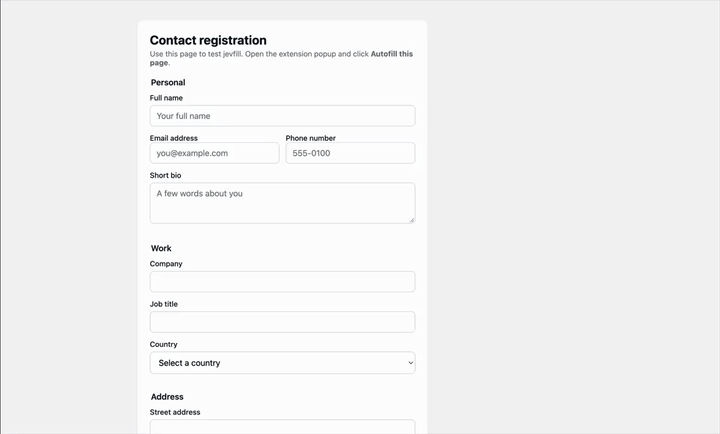

# Jevfill

[](LICENSE)
[](https://developer.chrome.com/docs/extensions/)
[](https://developer.chrome.com/docs/extensions/develop/migrate/what-is-mv3)
[](https://www.typescriptlang.org/)
[](https://www.typesafe.ai/)

Chrome extension that autofills web forms from unstructured notes with [Jev](https://www.typesafe.ai/) (by TypeSafe AI). Paste your details once as plain text — no structured profile required — then fill forms on demand.

## Demo



## How it works

1. Paste your personal details into the notes field in extension settings.
2. Open a page with a form and click **Autofill page** in the extension popup.
3. Jev matches each form field to the best line from your notes and fills it in.
4. Filled fields are briefly highlighted so you can review before submitting.

Password and payment fields are never sent to Jev or filled.

## Setup

### Install (developer mode)

```bash
npm install
npm run build
```

Then in Chrome:

1. Open `chrome://extensions`
2. Enable **Developer mode**
3. Click **Load unpacked** and select the `dist/` folder

### Configure

1. Open extension settings (right-click the toolbar icon → **Options**, or use the link in the popup).
2. Paste your notes (names, emails, phone numbers, addresses — one detail per line works best).
3. Add your Jev API key from [TypeSafe AI](https://www.typesafe.ai/).
4. Adjust the confidence threshold if needed (lower fills more fields; higher is more conservative).
5. Click **Save settings**.

## Development

```bash
npm run dev      # watch build
npm test         # run unit tests
npm run build    # typecheck + production build
```

### Manual testing

Open `test/sample-form.html` in the browser, configure the extension, and click **Autofill page**.

To exercise the Jev API directly, use `test/classify-sample-form.http` with the REST Client extension (or curl). Set your key first:

```bash
export TYPESAFE_API_KEY="your-key-here"
```

## Privacy

- Notes are stored locally in `chrome.storage.local` on your device.
- When you autofill, field context and your notes are sent to Jev (via TypeSafe AI).
- No analytics or other third-party data collection.

## License

MIT — see [LICENSE](LICENSE).
